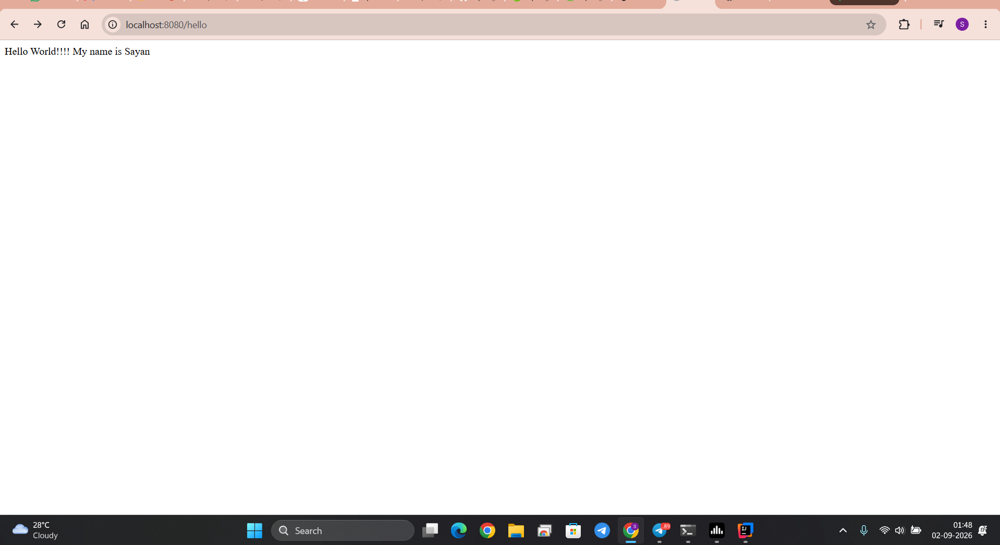
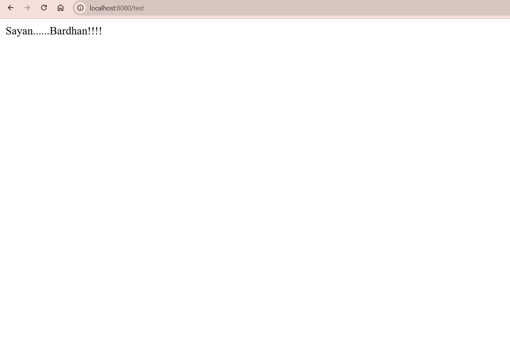

# Spring Boot - FirstSpringProject

A beginner-friendly Spring Boot REST API project built with **Java 21**, **Spring Boot**, and **Gradle**. This project demonstrates how to create simple REST endpoints and run a Spring Boot application locally.

## Tech Stack

- Java 21 (LTS)
- Spring Boot
- Gradle
- IntelliJ IDEA

## Project Structure

```text
FirstSpringProject/
├── src/
├── build.gradle
├── settings.gradle
├── gradlew
├── gradlew.bat
├── README.md
├── home-page.png
├── hello-endpoint.png
└── test-endpoint.png
```

## Getting Started

### Prerequisites

- Java 21
- IntelliJ IDEA
- Git

### Clone the Repository

```bash
git clone https://github.com/Sayancode2026/Spring-Boot.git
cd Spring-Boot
```

### Run the Application

Open the project in IntelliJ IDEA and run:

```text
FirstSpringProjectApplication
```

The application will start at:

```text
http://localhost:8080
```

## API Endpoints

| Method | Endpoint | Description |
|--------|----------|-------------|
| GET | `/` | Returns the welcome message |
| GET | `/hello` | Returns a Hello World message |
| GET | `/test` | Returns a custom response |

## Output Preview

### Home (`/`)


Displays the default welcome response.

---

### Hello (`/hello`)



Returns a greeting message.

---

### Test (`/test`)



Returns a custom text response.

## Sample Controller

```java
@RestController
public class HelloController {
    @GetMapping("/hello")
     public String getHello(){
        return "Hello World!!!! My name is Sayan";
    }

    @GetMapping("/")
    public  String getHome(){
        return  "Welcome home.........";
    }

    @GetMapping("/test")
    public  String getTest(){
        return  "Sayan......Bardhan!!!!";
    }
}
```

## Features

- Spring Boot project setup
- REST Controller implementation
- Multiple GET endpoints
- Gradle build configuration
- Java 21 support
- Local development using IntelliJ IDEA

